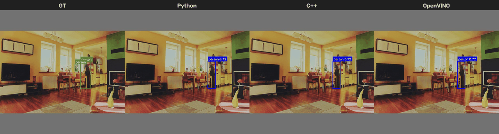

# Person Detection: Python to C++

An end-to-end person-detection project using YOLO11n and COCO val2017. The
same person-detection task is evaluated with Python/PyTorch on CPU, C++/ONNX
Runtime on CPU, and C++/OpenVINO on an Intel integrated GPU (iGPU).

## YOLO11n Runtime Comparison



🟩 Ground truth is shown in green. 🟦 Python, C++, and OpenVINO predictions
are shown in blue at a confidence threshold of **0.25**.

### Benchmark Results

All implementations evaluated the COCO val2017 `person` category over **5,000**
images with an input size of **640**, batch size **1**, confidence threshold **0.001**, NMS IoU threshold **0.70**, and at most **100** detections per image.


<table width="100%">
  <thead>
    <tr>
      <th>Metric</th>
      <th>GT</th>
      <th>Python CPU</th>
      <th>C++ CPU</th>
      <th>OpenVINO iGPU</th>
      <th>&Delta; (OpenVINO/Python)</th>
    </tr>
  </thead>
  <tbody>
    <tr>
      <td>Person AP@[0.50:0.95]</td>
      <td align="right">-</td>
      <td align="right">0.5292</td>
      <td align="right">0.5338</td>
      <td align="right">0.5338</td>
      <td align="right">+0.0046</td>
    </tr>
    <tr>
      <td>Person BBoxes</td>
      <td align="right">11,004</td>
      <td align="right">9,019</td>
      <td align="right">9,384</td>
      <td align="right">9,383</td>
      <td align="right">+364</td>
    </tr>
    <tr>
      <td>Model latency</td>
      <td align="right">-</td>
      <td align="right">29.50 ms</td>
      <td align="right">23.01 ms</td>
      <td align="right">5.79 ms</td>
      <td align="right">5.10x</td>
    </tr>
    <tr>
      <td>End-to-end throughput</td>
      <td align="right">-</td>
      <td align="right">22.94 img/s</td>
      <td align="right">20.39 img/s</td>
      <td align="right">47.69 img/s</td>
      <td align="right">2.08x</td>
    </tr>
  </tbody>
</table>

## Repository Layout

```text
.
|-- configs/                 Shared experiment settings
|-- python/                  Python programs, dependencies, and documentation
|-- cpp/                     C++17, CMake, and C++ documentation
|-- docker/                  Reproducible container definitions
|-- web/                     Browser interface for the C++ HTTP server
|-- evaluation/              Shared COCO evaluation and comparison tools
|-- datasets/                Downloaded data and dataset utilities
|-- models/                  Models shared by Python and C++
|-- outputs/                 Generated images and raw predictions
|-- results/                 Compact evaluation summaries tracked by Git
|-- .gitignore
`-- README.md
```

Datasets, model weights, and generated outputs are excluded from Git. Python
and C++ share the same `configs/`, `datasets/`, `models/`, and `outputs/`
directories to support fair comparisons.

## Common Data and Model Setup

The Python and ONNX Runtime CPU pipelines use WSL 2 with Ubuntu 22.04. The
OpenVINO iGPU pipeline uses Ubuntu 24.04 for Intel Arc B390 compute-runtime
support. Clone the repository and enter it from WSL:

```bash
git clone https://github.com/johyeongseob/person-detection-python-cpp.git
cd person-detection-python-cpp
```

For a repository stored on the Windows filesystem:

```bash
cd /mnt/c/Users/YOUR_WINDOWS_USERNAME/PATH_TO_PROJECT
```

Download COCO val2017 images and annotations:

```bash
sudo apt update
sudo apt install -y wget unzip
mkdir -p datasets/coco
wget -c -P datasets/coco \
  https://s3.amazonaws.com/images.cocodataset.org/zips/val2017.zip
wget -c -P datasets/coco \
  https://s3.amazonaws.com/images.cocodataset.org/annotations/annotations_trainval2017.zip
unzip -q datasets/coco/val2017.zip -d datasets/coco
unzip -q datasets/coco/annotations_trainval2017.zip -d datasets/coco
```

### Download YOLO11n

YOLO11n is a common project asset shared by Python and C++. Model files are
ignored by Git. After installing the Python dependencies described in
[`python/README.md`](python/README.md), download the official Ultralytics
weights from the repository root:

```bash
mkdir -p models/yolo11n
(
  cd models/yolo11n
  python -c "from ultralytics import YOLO; YOLO('yolo11n.pt')"
)
ls -lh models/yolo11n/yolo11n.pt
```

The shared model locations are:

```text
models/yolo11n/yolo11n.pt      Python model
models/yolo11n/yolo11n.onnx    ONNX Runtime C++ model
models/yolo11n/openvino/       OpenVINO IR model and metadata
```

## Configuration

All runtimes share one configuration file. Backend-specific model paths and
devices are stored alongside the common dataset and evaluation settings.

```text
configs/yolo11n/person_detection.yaml
```

The shared keys define the model and dataset paths, input size, detection and
evaluation thresholds, maximum detections, and output directories.


## Docker

The public Docker image packages the C++ CPU applications, HTTP server,
OpenCV runtime, and ONNX Runtime in an Ubuntu 22.04 environment. Model files,
datasets, and generated outputs remain outside the image and are mounted at
runtime.

Pull the prebuilt image from Docker Hub:

```bash
docker pull johyeongseob/person-detection-cpp:dev
```

Prepare the external YOLO11n ONNX model with the provided script. On its first
run, the script creates `.venv`, installs the pinned Python dependencies,
downloads the official PyTorch weights, and exports them to ONNX:

```bash
bash scripts/prepare_yolo11n.sh
```


Start the C++ person-detection web server from Linux or WSL:

```bash
docker run --rm \
  --publish 8080:8080 \
  --volume "$(pwd)/models:/workspace/models:ro" \
  johyeongseob/person-detection-cpp:dev
```

Open the browser interface and upload an image:

```text
http://localhost:8080
```

The model is loaded once when the server starts. Each `POST /detect` request
runs the existing C++ detector and returns a JPEG with person bounding boxes.
`GET /health` provides a lightweight status check.

The original command-line detector remains available by overriding the
container command and mounting the model, dataset, and output directories:

```bash
docker run --rm \
  --volume "$(pwd)/models:/workspace/models:ro" \
  --volume "$(pwd)/datasets:/workspace/datasets:ro" \
  --volume "$(pwd)/outputs:/workspace/outputs" \
  johyeongseob/person-detection-cpp:dev \
  detect_person_image
```


The container isolates the application dependencies, so users do not need to
install OpenCV, ONNX Runtime, or CMake on the host. Docker itself and the
external model file are still required.

## Citation

This project uses Ultralytics YOLO11 and the Microsoft COCO dataset:

```bibtex
@software{yolo11_ultralytics,
  author = {Glenn Jocher and Jing Qiu},
  title = {Ultralytics YOLO11},
  version = {11.0.0},
  year = {2024},
  url = {https://github.com/ultralytics/ultralytics},
  orcid = {0000-0001-5950-6979, 0000-0003-3783-7069},
  license = {AGPL-3.0}
}

@inproceedings{lin2014microsoft,
  title = {Microsoft COCO: Common Objects in Context},
  author = {Lin, Tsung-Yi and Maire, Michael and Belongie, Serge and
            Hays, James and Perona, Pietro and Ramanan, Deva and
            Doll{\'a}r, Piotr and Zitnick, C. Lawrence},
  booktitle = {European Conference on Computer Vision},
  pages = {740--755},
  year = {2014},
  organization = {Springer}
}
```
